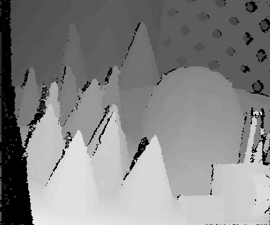

# StereoSGM
A single-thread CPU reference implementation of standard Semi-Global Matching (SGM) of stereo images.
The stereSGM engine itself is OpenCV indenpendent, while the testbench uses the OpenCV image IO functions to load/save the images.

### Pre-requisites
* Cmake 2.8
* OpenCV 3.4.5

### Build and run
```sh
$ export OpenCV_DIR=<path_to_opencv_install_dir>
$ mkdir build
$ cd build
$ cmake ..
$ make
$ ./stereoSGM ../data/cones/im2.png ../data/cones/im6.png
```

### Results



